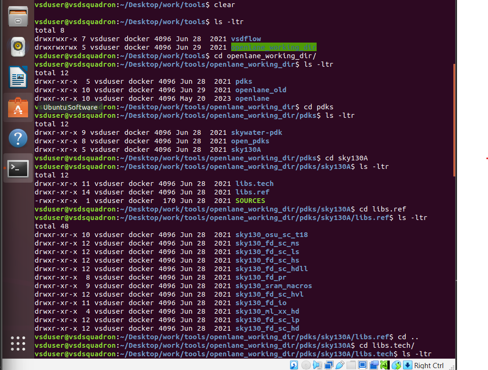
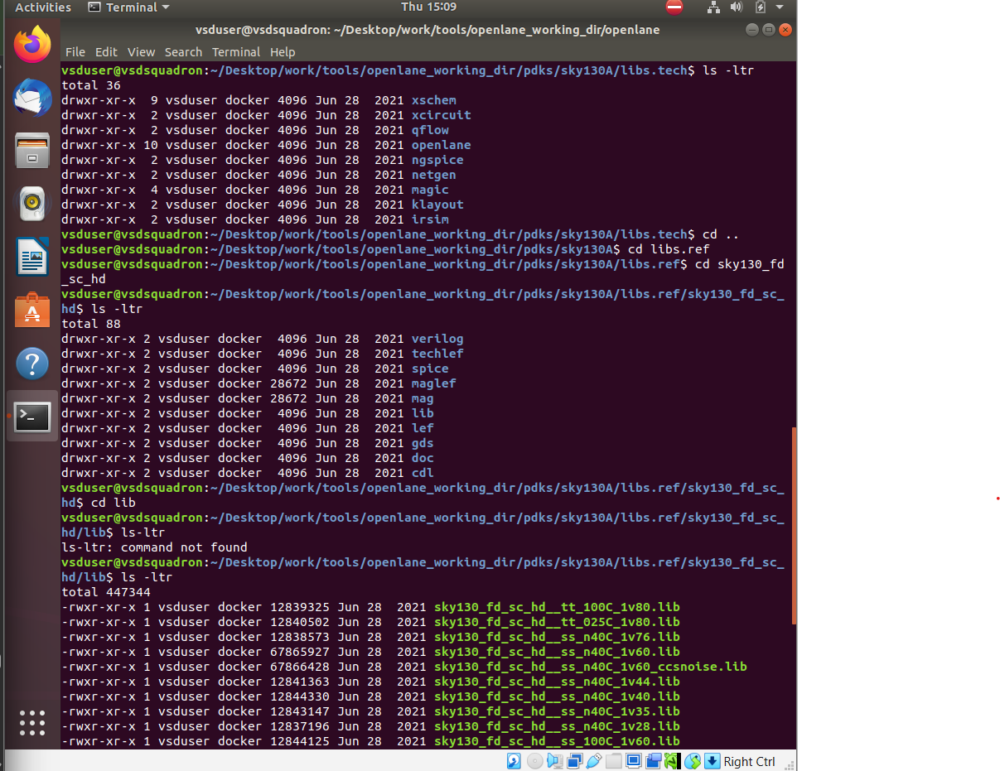
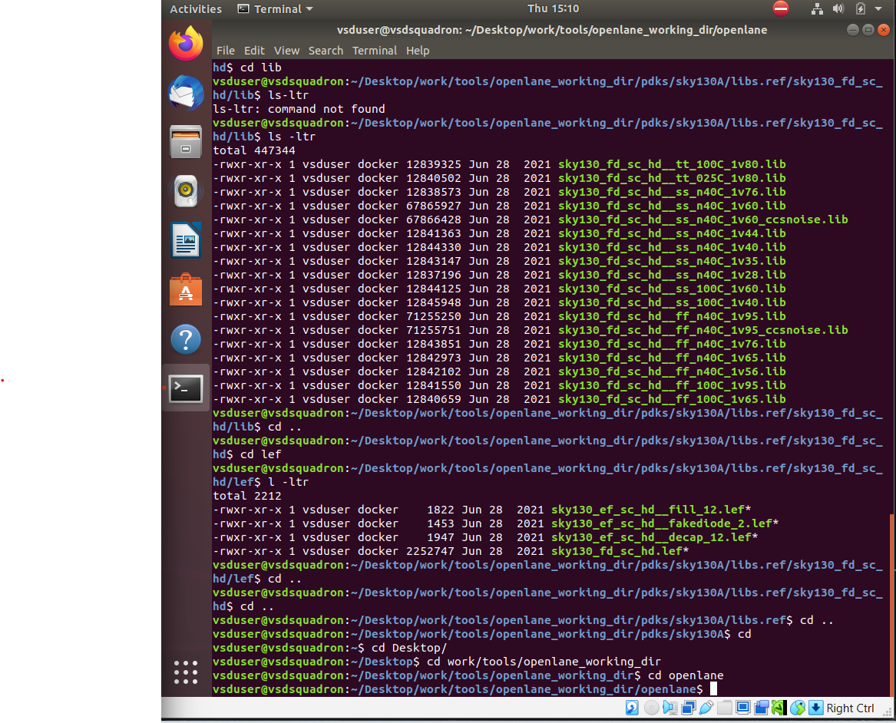

# SKY_L1 - OpenLANE Directory Structure

## Introduction

This lecture introduces:

- OpenLane environment setup
- Common Linux commands
- OpenLane working directory structure
- Process Design Kit (PDK) organization
- Sky130 PDK hierarchy
- OpenPDK compatibility layer

The lecture acts as an introductory walkthrough of the OpenLane tool environment.

---

# OpenLane Overview

OpenLane is not a single tool, it is a complete ASIC flow that integrates multiple open-source EDA tools together, like:

- Yosys
- OpenSTA
- Magic
- Netgen

The overall goal of OpenLane is Complete RTL-to-GDSII Automation with minimal human intervention.

# Basic Linux Commands

---

## cd → Change Directory

Used for moving between directories.

## ls → List Files

Used for listing directory contents.

## ls -ltr

Lists files:
- chronologically
- with detailed information

## Command Help

Linux commands can provide help using:

```bash
command_name --help
```

## clear

Used for clearing terminal screen.

---

---

# PDKs Directory

It contains all process technology information required for ASIC design. Inside the PDKs directory:

```text
skywater-pdk/
open_pdks/
sky130A/
```

## skywater-pdk

Contains:

- original foundry PDK files
- technology information
- timing libraries
- LEF files
- process data

These files are generally intended for commercial EDA tools.

## open_pdks

Open-source tools are not directly compatible with raw foundry files. open_pdks acts as a compatibility layer. It provides:

- scripts
- converted files
- open-source tool support

for tools such as:
- Magic
- Netgen
- OpenROAD

## sky130A

This is the Open-Source Compatible Sky130 PDK Variant used directly with OpenLane. It is a processed version of the SkyWater PDK compatible with open-source EDA flows.

## Important sky130A Subdirectories

Inside:

```text
sky130A/
```

there are two important directories:

```text
libs.ref/
libs.tech/
```

## libs.ref

It contains Process-Specific Files:

- timing libraries
- LEF files
- standard cell data
- technology models

## libs.tech

It contains Tool-Specific Files for tools such as:

- Magic
- Netgen
- KLayout
- Qflow
- OpenLane
- Ngspice

## Standard Cell Library Naming Convention

```text
sky130_fd_sc_hd
```

### sky130

Represents SkyWater 130nm technology.

### fd

Represents Foundry designation (SkyWater Foundry).

### sc

Represents Standard Cells.

### hd

Represents High Density library variant.

## Important Library Files

Inside the standard cell library:

### LEF Files

LEF stands for Library Exchange Format. It contains:

- abstract physical information
- cell dimensions
- routing blockages
- pin locations

### Tech LEF Files

Contains:

- layer rules
- routing layer definitions
- technology-specific routing information

### Liberty Files (.lib)

Contain:

- timing information
- power models
- delay models

Used during:

- synthesis
- timing analysis

### PVT Corners

The timing libraries contain multiple PVT Corners. Examples:

- TT → Typical-Typical
- SS → Slow-Slow
- FF → Fast-Fast

PVT represents:

- Process
- Voltage
- Temperature

These corners model different operating conditions.

---

# OpenLane Working Directory

The actual OpenLane flow is executed from:

```text
OpenLane/
```

## Purpose of OpenLane Directory

This directory contains:

- flow scripts
- configurations
- design folders
- automation infrastructure

used during RTL-to-GDSII implementation.

---






---

# Key Takeaways

- OpenLane is a complete RTL-to-GDSII flow, not a single tool.
- Linux terminal knowledge is important for ASIC workflows.
- PDKs provide technology and fabrication information.
- OpenPDKs convert foundry files for open-source tool compatibility.
- sky130A is the OpenLane-compatible Sky130 PDK.
- libs.ref contains process-specific data.
- libs.tech contains tool-specific data.
- Liberty, LEF, and Tech LEF files are essential for ASIC flow.
- PVT corners model different operating conditions.
- OpenLane should always be executed from the correct working directory.