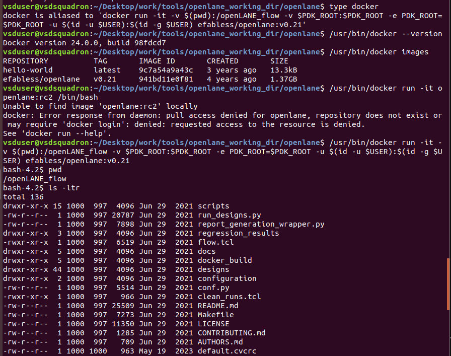
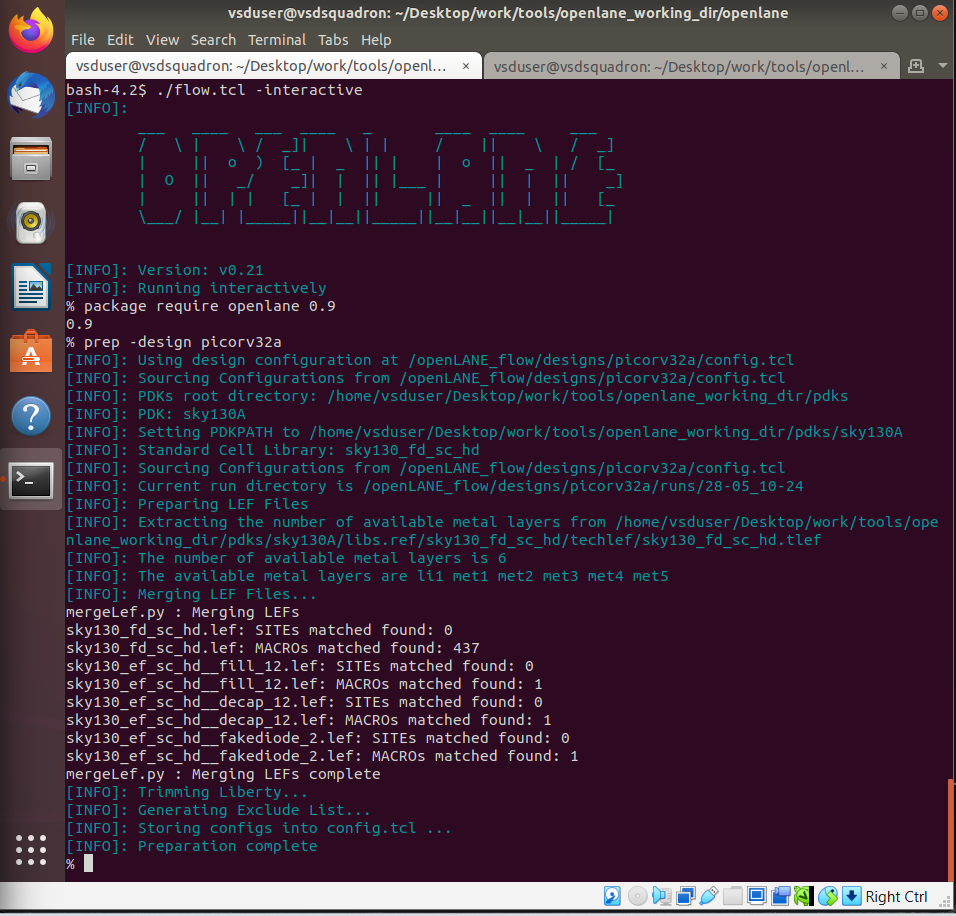
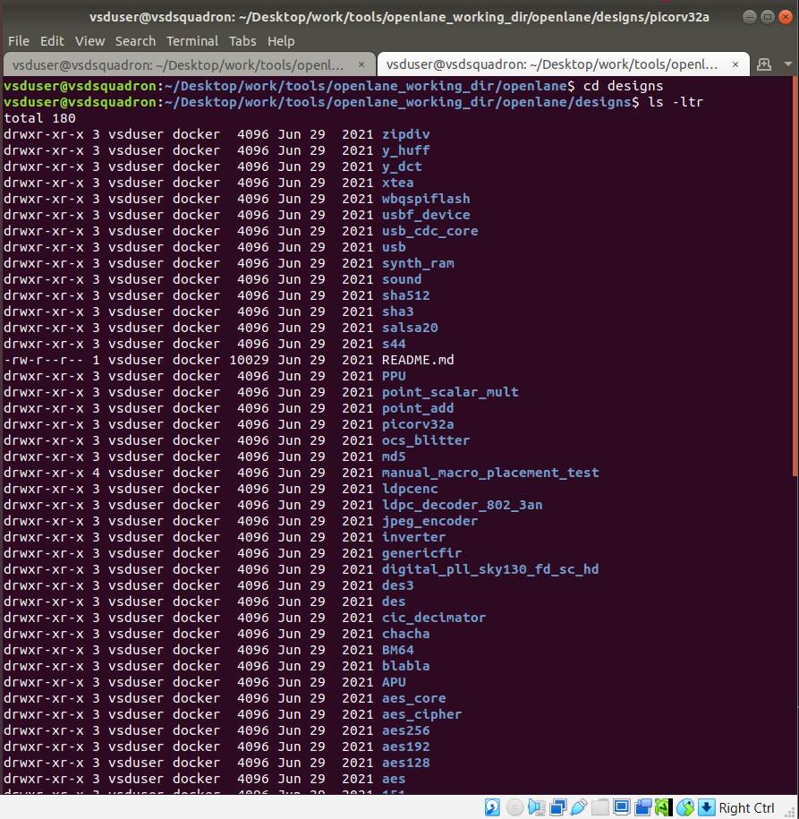
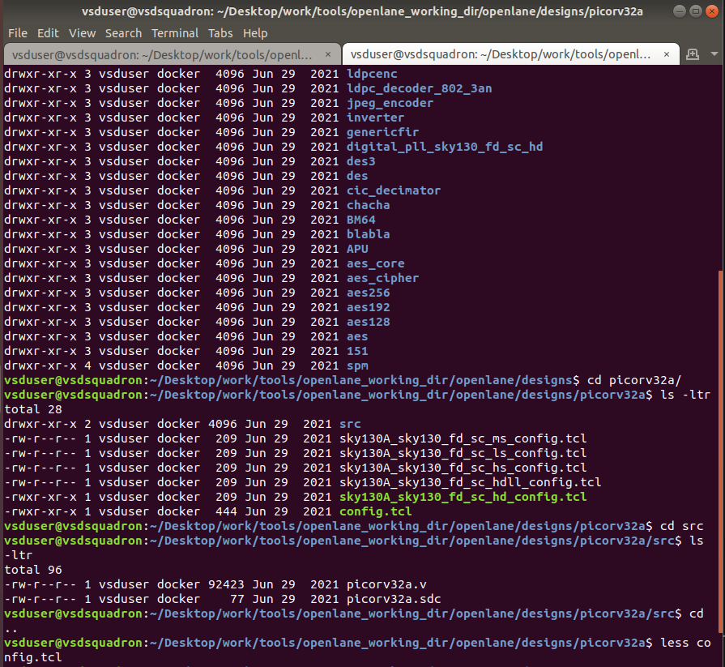
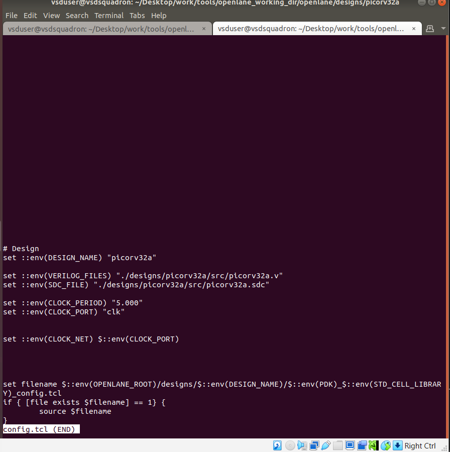

# SKY_L2 - Design Preparation Step

## Introduction

This lecture explains:

- Interactive OpenLane flow execution
- Design directory structure
- Configuration hierarchy
- Design preparation stage
- LEF merging process

The lecture focuses on understanding the flow step-by-step rather than executing the entire automated RTL-to-GDSII process at once.

---

# Interactive Mode in OpenLane

OpenLane supports Interactive Flow Execution. In interactive mode:

- each stage is executed manually
- intermediate results can be inspected
- debugging and learning become easier

This differs from fully automated push-button execution.

---

# Running OpenLane Flow

The OpenLane flow is controlled using:

```text
flow.tcl
```

This TCL script controls:

- flow stages
- configurations
- tool execution

---

# Opening Interactive Mode

The lecture demonstrates opening OpenLane in Interactive Mode

When interactive mode is enabled:

- OpenLane prompt changes
- commands can be executed step-by-step

---

# Importing Required Packages

Before executing flow commands OpenLane Packages must be imported. These packages contain:

- OpenLane procedures
- utility commands
- flow infrastructure

---

# OpenLane Designs Directory

All OpenLane designs are stored inside:

```text
designs/
```

OpenLane already includes:

- multiple example designs
- reference configurations

---

# Design Directory Structure

Inside the design directory:

```text
src/
config.tcl
<PDK-specific config files>
```

---

# src Directory

The src directory contains:

- RTL Verilog files
- SDC constraints

## Files Inside src

- Verilog RTL source files
- SDC timing constraints

---

# config.tcl

This is the:

## Design-Specific Configuration File

It overrides default OpenLane configuration values. Examples of configurable parameters:

- clock period
- design name
- RTL paths
- synthesis options

---

# Configuration Precedence in OpenLane

OpenLane follows a priority hierarchy for configuration values.

## 1. Default OpenLane Settings

Lowest priority.

## 2. config.tcl

Overrides default flow settings.

## 3. PDK-Specific Configuration File

Highest priority.

Can override:

- config.tcl settings
- default settings

---

# PDK-Specific Configuration

The design may include PDK-Specific Configuration Files like Sky130-specific settings. These files are conditionally loaded if present.

## Purpose of Conditional Loading

OpenLane checks whether the file exists before sourcing it. This allows:

- portability
- flexible design support
- multi-PDK compatibility

---

# Design Preparation Stage

Before synthesis, Design Preparation must be executed.

## Purpose of Design Preparation

Preparation stage:

- creates required directory structure
- prepares file system organization
- generates flow-specific folders
- organizes intermediate data

Each flow stage expects:
- files at predefined locations

Preparation ensures:
- correct setup for subsequent stages

---

# Preparation Command

The lecture demonstrates preparation using:

```text
prep -design <design_name>
```

Example:
- PicoRV32A

---

# LEF Merging

During preparation
```text
mergeLEF.py
```
is executed.

## Purpose of LEF Merging

The process merges:

- Cell LEF
- Technology LEF

into a single merged LEF file.

## Why Merge LEFs?

Without merging, tools would need to access multiple LEF files. Merged LEF simplifies:

- placement
- routing
- geometry access

---

# Cell LEF

Contains:
- standard cell geometry
- pin information
- macro dimensions

---

# Technology LEF (Tech LEF)

Contains:

- routing layer information
- technology rules
- metal definitions

---

# After Preparation

The design directory gains:

- new flow folders
- intermediate directories
- run-specific structures

These are used by:

- synthesis
- placement
- routing
- verification

---

# Interactive Learning Advantage

Interactive execution helps users:

- understand each ASIC flow stage
- inspect intermediate outputs
- debug issues
- learn OpenLane internals

This is especially useful for:

- beginners
- experimentation
- flow customization

---







---

# Key Takeaways

- OpenLane supports interactive step-by-step flow execution.
- flow.tcl controls the ASIC implementation flow.
- Designs are stored inside the designs directory.
- src contains RTL and timing constraints.
- config.tcl overrides default OpenLane settings.
- PDK-specific configs have highest precedence.
- Design preparation creates required file structures.
- mergeLEF.py merges cell LEF and tech LEF files.
- Preparation is required before synthesis.
- Interactive mode helps understand and debug the flow.