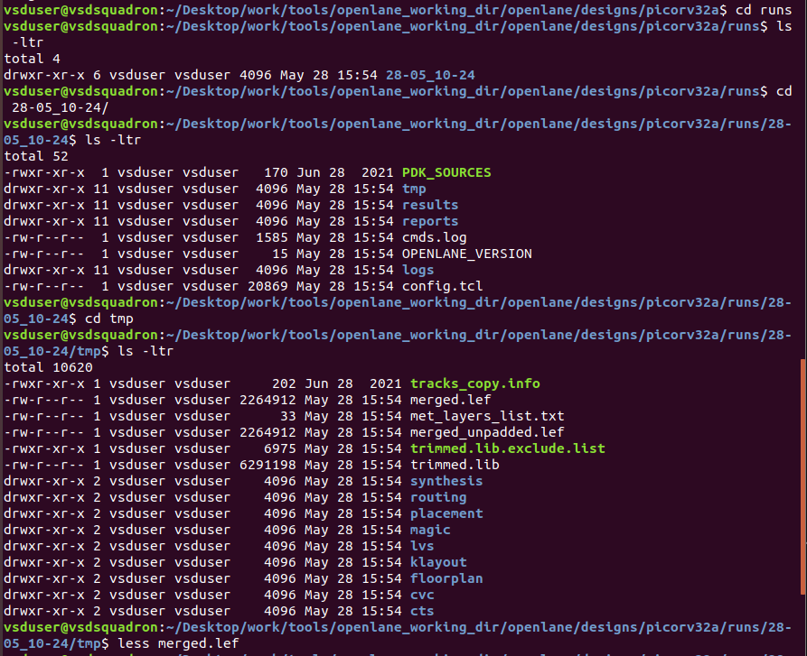
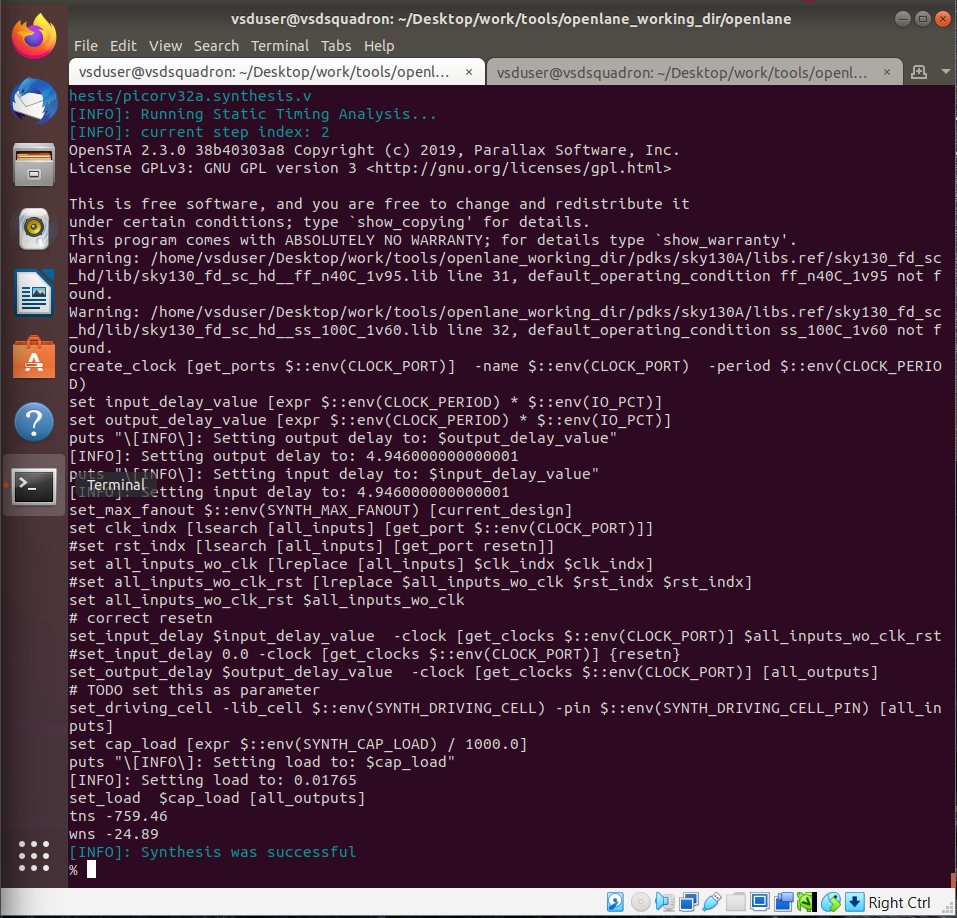

# SKY_L3 - Review Files after Design Prep and Run Synthesis

## Introduction

This lecture explains:

- OpenLane run directory structure
- generated folders after design preparation
- temporary files
- logs and reports
- merged LEF files
- configuration tracking
- synthesis execution

The lecture focuses on understanding the files generated during the preparation stage and introduces the synthesis stage of the OpenLane flow.

---

# Run Directory Creation

After executing the preparation stage:

```text
prep -design <design_name>
```

OpenLane automatically creates 
```text
runs/
```
directory inside the design folder.

---

# Timestamp-Based Run Folder

Inside:
```text
runs/
```
OpenLane creates a timestamp-based folder. This directory stores:

- all intermediate flow data
- logs
- reports
- generated files

for that particular run.

---

# OpenLane Run Directory Structure

Inside the run directory:
```text
logs/
reports/
results/
tmp/
```
along with folders for:

- synthesis
- floorplan
- placement
- routing
- CTS
- signoff

---

# Purpose of Each Directory

## tmp Directory

The tmp directory stores:

- temporary files
- intermediate generated data

One important generated file is
```text
merged.lef
```

### merged.lef

This file is generated using:
```text
mergeLEF.py
```
It combines Technology LEF and Cell LEF into a single LEF file. This allows OpenLane tools to access:

- layer information
- routing rules
- cell geometry

from one consolidated file. The merged LEF contains Technology-Level Information, like:

- routing layers
- wire rules
- metal definitions

as well as Cell-Level Information, like:

- macro definitions
- standard cell geometry
- pin locations

## results Directory

The results directory stores:

- generated outputs
- stage-wise implementation results

Examples:

- synthesized netlists
- placement DEF files
- routed layouts

Initially most folders remain empty until the corresponding flow stage executes.

## reports Directory

The reports directory contains:

- timing reports
- synthesis reports
- utilization reports
- verification reports

If timing constraints (SDC) are provided, then STA-related reports are generated. Initially, reports directory is mostly empty before synthesis execution.

## logs Directory

The logs directory stores detailed execution logs
for every flow stage.

These logs help with:

- debugging
- flow analysis
- error diagnosis

---

# config.tcl

It's inside the run directory. There are two config.tcl files we've seen so far:

## Design-Level config.tcl

- Located inside design directory
- Contains user-defined configuration overrides

## Run-Level config.tcl

- Located inside run directory
- Contains final resolved configuration values
actually used during execution.

### Purpose of Run-Level config.tcl

This file records:

- effective configuration values
- library paths
- timing libraries
- routing information
- synthesis settings

used during the current run.

### Information Stored in Run Config

Examples include:

- PDK information
- track information
- LEF paths
- synthesis libraries
- min/max timing libraries
- transition libraries

---

# Dynamic Configuration Updates

OpenLane allows On-the-Fly Configuration Changes. If a parameter is modified in the original config file rerunning the stage updates the run config automatically.

---

## commands.log

This file records all executed OpenLane commands. As more stages execute, additional command history is appended.

---

# Running Synthesis

After preparation, Synthesis is executed.

## Purpose of Synthesis Stage

The synthesis stage performs:

- RTL synthesis using Yosys
- technology mapping using ABC

This converts RTL into gate-level netlist.

---

# OpenLane Workflow Summary

```text
Design Preparation
        ↓
Run Directory Creation
        ↓
LEF Merging
        ↓
Configuration Setup
        ↓
Synthesis Execution
        ↓
Generated Logs & Reports
```

---




---

# Key Takeaways

- OpenLane creates timestamp-based run directories.
- tmp stores intermediate temporary files.
- merged.lef combines technology and cell LEF data.
- logs contain execution details for debugging.
- reports contain timing and synthesis analysis outputs.
- run-level config.tcl records final effective configurations.
- commands.log tracks executed commands.
- Synthesis uses Yosys and ABC.