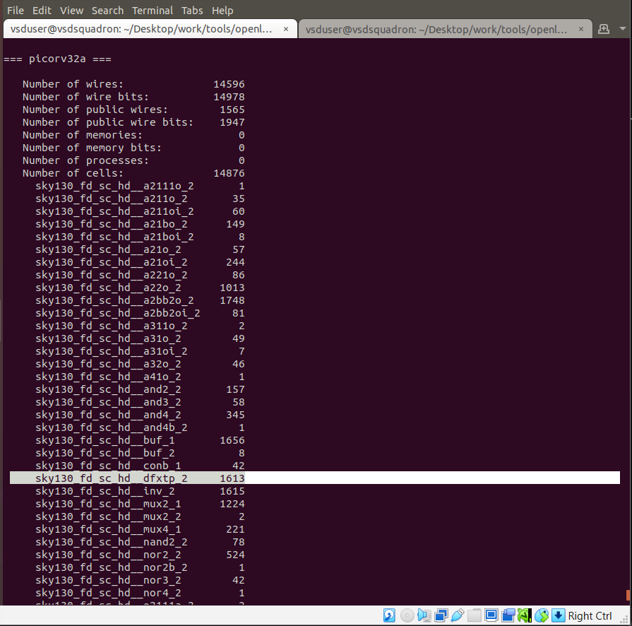
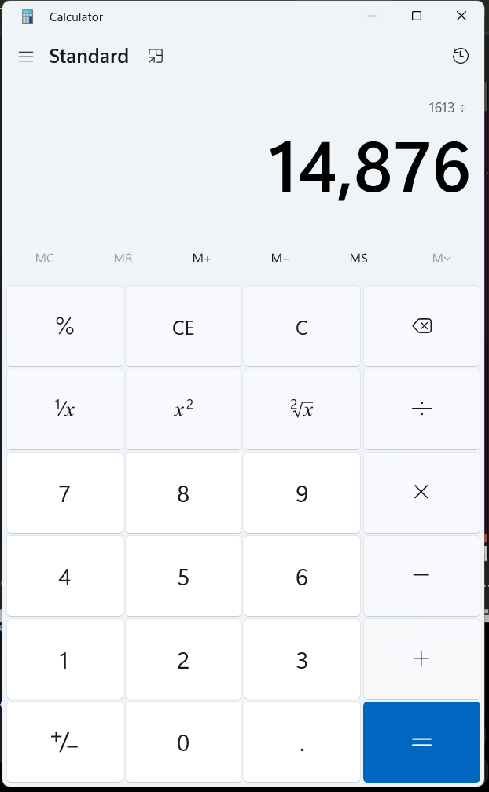
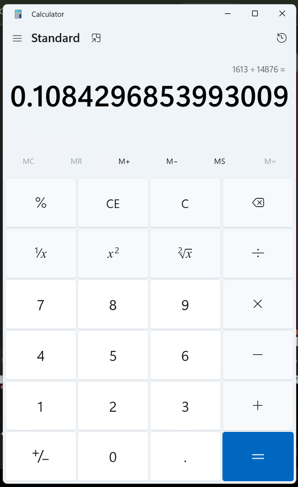
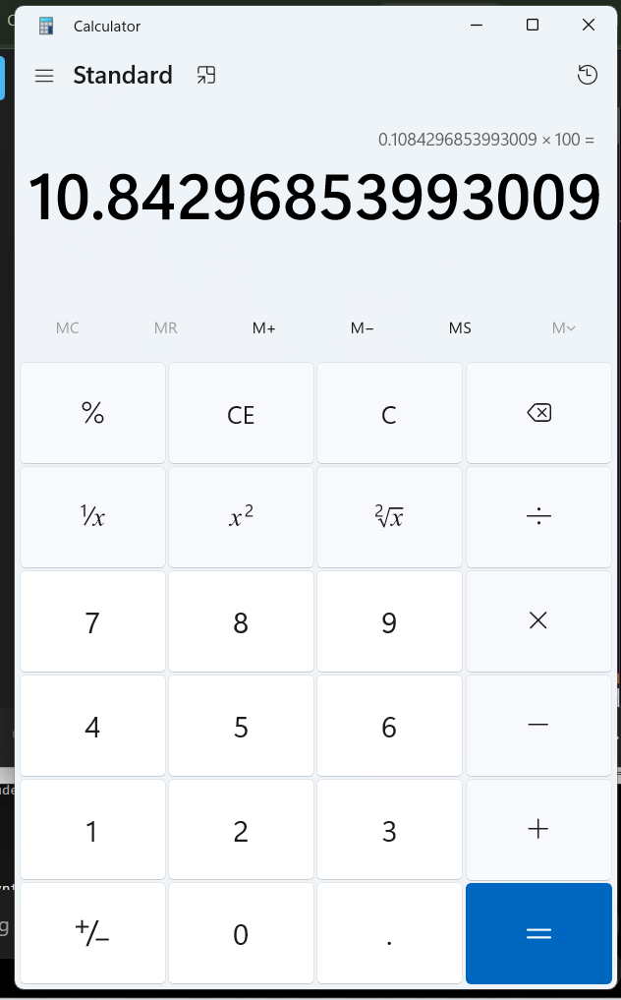
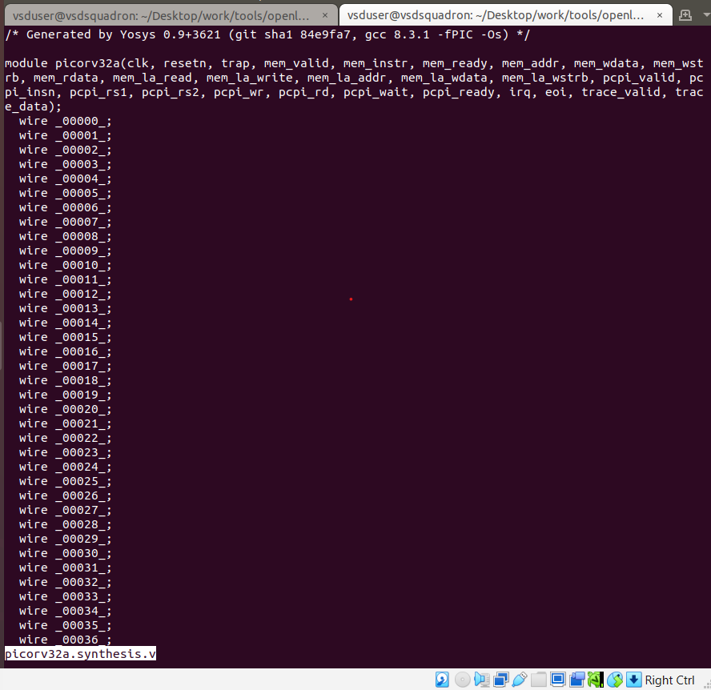
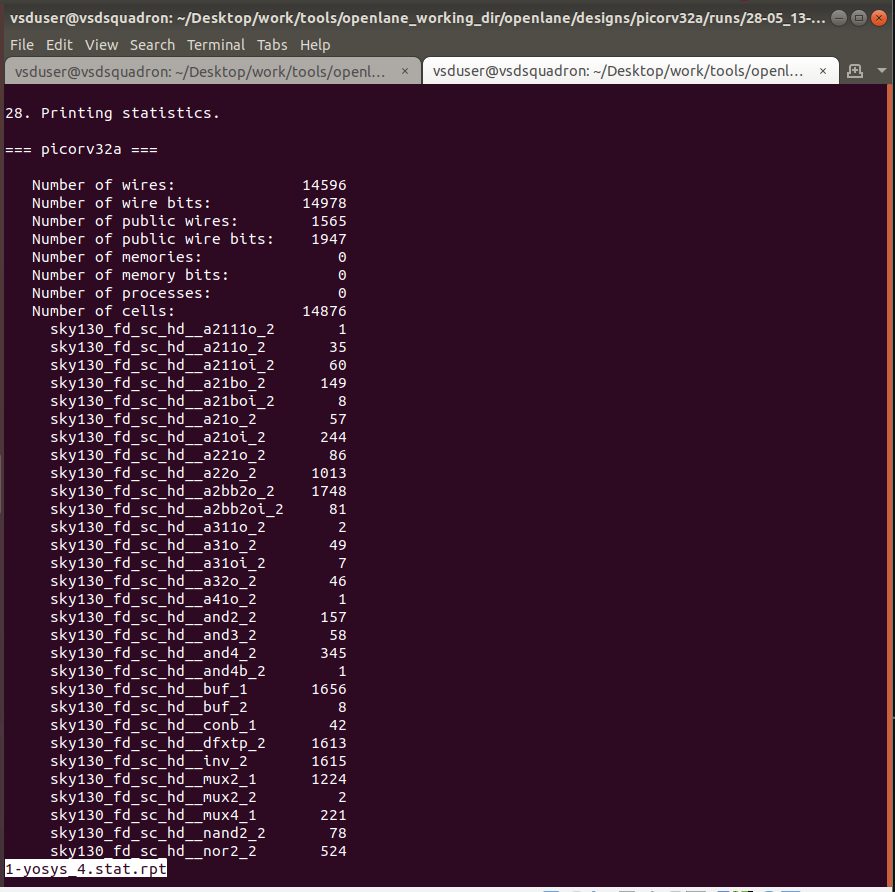
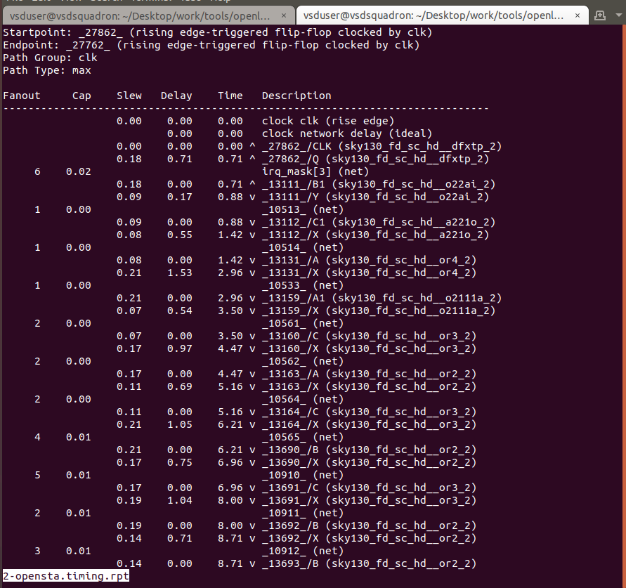

# SKY_L5 - Steps to Characterize Synthesis Results

## Introduction

This lecture explains:

- synthesis completion in OpenLane
- synthesis reports
- synthesized netlists
- flop ratio calculation
- report directory structure
- OpenSTA reports
- analyzing synthesis statistics

---

# Completion of Synthesis

At this stage:

- RTL synthesis has completed
- ABC technology mapping has completed

The design has now been converted from RTL
into gate-level netlist using standard cells from the Sky130 library.

---

# Synthesis Output Information

After synthesis completion, OpenLane displays:

- chip statistics
- area information
- cell counts
- timing information

These reports help evaluate:

- design complexity
- resource utilization
- synthesis quality

---

# Flop Ratio

## Definition of Flop Ratio

Flop ratio is defined as:
```text
(Number of D Flip-Flops)
        ÷
(Total Number of Cells)
```

## Formula for Flop Ratio Percentage

```text
Flop Ratio (%) =
(Number of Flip-Flops / Total Cells) × 100
```

---

# Flop Ratio Calculation






Thus approximately 10.84% of the cells are flip-flops.

---

# Importance of Flop Ratio

Flop ratio helps estimate:

- sequential logic density
- pipeline complexity
- storage overhead

Higher flop ratios generally indicate:

- more sequential logic
- larger state storage

---

# Results Directory after Synthesis

After synthesis execution 
```text
results/synthesis
```
gets populated.

---

# Synthesized Netlist

The synthesis directory now contains Gate-Level Netlist. This netlist includes:

- mapped standard cells
- optimized logic
- synthesized connections

---

# Technology Mapping

ABC has already completed:

- technology mapping
- logic optimization

Thus generic logic has been replaced with Sky130 standard cells.

---

# Reports Directory

Synthesis reports are generated inside:
```text
reports/synthesis
```

These reports include:
- statistics
- timing analysis
- optimization summaries

---

# Synthesis Statistics Report

This contains:

- cell counts
- flip-flop counts
- area statistics
- logic distribution

The flip-flop count used in the workshop task is extracted from this report.

---

# Timing Reports

Timing-related reports are also generated.

These may include:

- pre-layout timing analysis
- OpenSTA reports
- delay summaries

---

# OpenSTA Reports

OpenSTA generates Pre-Layout Timing Reports. These help evaluate:

- setup timing
- hold timing
- path delays

before physical implementation begins.

---

# Importance of Report Analysis

Report analysis is critical because it helps designers:

- evaluate synthesis quality
- understand timing bottlenecks
- estimate area usage
- debug optimization issues

---

# OpenLane Run Data Evolution

Directories initially empty become populated progressively as flow stages execute.

Examples:

- synthesized netlists
- reports
- logs
- timing summaries

are generated dynamically.

---

# Overall Flow Progress

At this point the completed stages are:

```text
Design Preparation
        ↓
LEF Merging
        ↓
RTL Synthesis
        ↓
ABC Mapping
        ↓
Report Generation
```

---




---

# Key Takeaways

- RTL synthesis converts RTL into gate-level netlist.
- ABC performs technology mapping and optimization.
- Flop ratio measures sequential logic density.
- Synthesis results are stored inside results/synthesis.
- Timing and statistics reports are stored inside reports/synthesis.
- OpenSTA generates pre-layout timing analysis reports.
- Reports are essential for analyzing synthesis quality.
- OpenLane progressively populates run directories during execution.