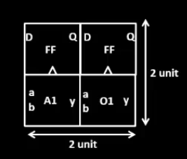
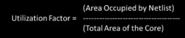

# SKY_L1 - Utilization Factor and Aspect Ratio

## Introduction

This lecture introduces two fundamental concepts used during floorplanning

- Utilization Factor
- Aspect Ratio

These parameters help determine:

- Core dimensions
- Die dimensions
- Available placement area
- Future optimization capability

The lecture explains these concepts using a simple netlist consisting of:

- Two flip-flops
- One AND gate
- One OR gate

---

# Physical Design Flow Context

During physical design, one of the earliest tasks is Determining the Width and Height of the Core and Die. Before:

- placement
- routing
- clock tree synthesis

we must determine:

- core size
- die size

This decision is primarily based on:

- cell area
- expected utilization
- routing requirements

---

# Example Netlist

Consider the following simple netlist:

```text
Launch FF
     ↓
   AND
     ↓
    OR
     ↓
Capture FF
```

Components:

- Launch Flip-Flop
- AND Gate
- OR Gate
- Capture Flip-Flop

---

# Assigning Physical Dimensions

To understand area calculation, assume:

Each cell occupies:

```text
1 unit × 1 unit
```

Therefore:

```text
Area = 1 square unit
```

for every gate and flip-flop.

---

# Cell Areas

| Cell | Area |
|--------|--------|
| Launch FF | 1 sq. unit |
| AND Gate | 1 sq. unit |
| OR Gate | 1 sq. unit |
| Capture FF | 1 sq. unit |

Total area:

```text
1 + 1 + 1 + 1 = 4 square units
```

---

# Minimum Netlist Area

Ignoring wires and considering only cell dimensions:



Dimensions:

```text
Width = 2 units
Height = 2 units
```

Area:

```text
2 × 2 = 4 square units
```

This is the minimum area occupied by the netlist.

---

# Core and Die

The lecture introduces two important chip regions.

## Die

The die is:

- the complete silicon area allocated for the design
- the region fabricated on silicon

A silicon wafer contains multiple dies.

## Core

The core is:

- the area inside the die
- where actual logic cells are placed

Standard cells and macros are placed only inside the core.

---

# Example 1 - 100% Utilization

Assume:

```text
Core Area = 2 × 2
```

and the netlist occupies:

```text
4 square units
```

which completely fills the core.

---

# Utilization Factor

## Definition

Utilization Factor is:



## Example Calculation

Netlist Area = 4

Core Area = 2 x 2 = 4

Therefore:

```text
Utilization Factor = 1
```

or

```text
100% Utilization
```

---

# Meaning of 100% Utilization

A utilization factor of:

```text
1
```

means:

- Core is completely occupied
- No additional cells can be inserted
- No room remains for optimization

This is generally avoided in practical designs.

---

# Practical Utilization Values

Typical utilization values:

| Utilization | Meaning |
|------------|----------|
| 50% | Conservative |
| 60% | Common |
| 70% | Aggressive |
| 100% | Not practical |

Most designs target:

```text
50% – 60%
```

to leave room for:

- routing
- buffers
- optimization cells

---

# Aspect Ratio

## Definition

```text
Aspect Ratio = Height/Width
```

---

# Example Calculation

Core dimensions:

```text
Height = 2
Width = 2
```
Therefore:
```text
Aspect Ratio = 2/2 = 1
```

---

# Interpretation

When:

```text
Aspect Ratio = 1
```

the core is square.

---

# Example 2 - 50% Utilization

Now consider:

```text
Core Height = 2 units
Core Width  = 4 units
```

Core Area:
```text
2 x 4 = 8
```
```text
Netlist Area = 4
```

---

# Utilization Calculation

```text
Utilization Factor = 4/8
```
Therefore:

```text
Utilization Factor = 0.5
```

or

```text
50% Utilization
```

---

# Meaning of 50% Utilization

This means:

- Only half of the core is occupied
- Extra area remains available
- Additional cells may be inserted

Examples:

- Buffers
- Repeaters
- Optimization cells

---

# Aspect Ratio Calculation

Height:

```text
2
```

Width:

```text
4
```

Therefore 
```text
Aspect Ratio = 2/4 = 0.5
```
---

# Interpretation

Since:

```text
Aspect Ratio ≠ 1
```

the core becomes rectangular.

---

# Relationship Between Utilization and Aspect Ratio

These parameters are independent.

---

## Utilization Factor

Determines how much of the core is occupied.

---

## Aspect Ratio

Determines shape of the core.

Examples:

| Aspect Ratio | Shape |
|-------------|--------|
| 1 | Square |
| < 1 | Rectangle |
| > 1 | Rectangle |

---

# Why These Parameters Matter

During floorplanning:

- core dimensions are selected
- utilization targets are chosen
- future optimization space is reserved

Poor choices can lead to:

- congestion
- routing difficulty
- timing issues

---

# Key Takeaways

- Core contains the actual logic cells.
- Die encapsulates the entire design region.
- Utilization Factor measures how much of the core is occupied.
- 100% utilization leaves no room for optimization.
- Practical designs typically use 50–60% utilization.
- Aspect Ratio is defined as height divided by width.
- Aspect Ratio = 1 corresponds to a square core.
- Aspect Ratio ≠ 1 corresponds to a rectangular core.
- Utilization and aspect ratio are fundamental floorplanning parameters.