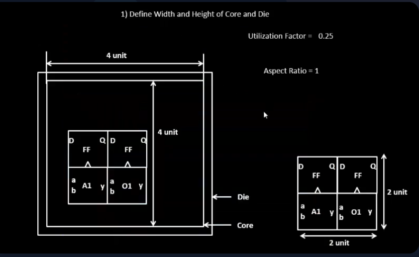
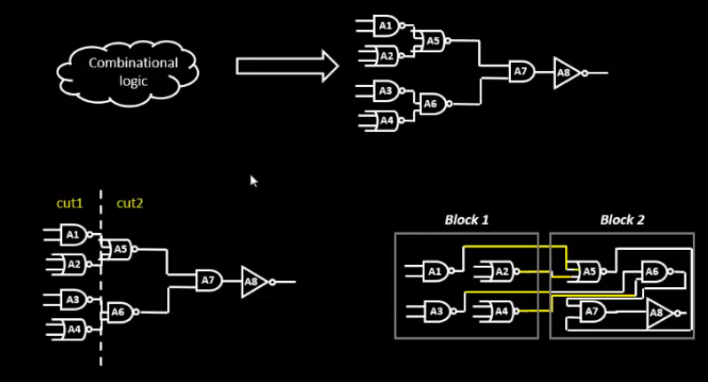
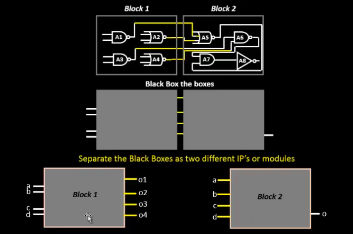

# SKY_L2 - Concept of Pre-Placed Cells

## Introduction

This lecture continues the discussion on:

- Utilization Factor
- Aspect Ratio
- Core sizing

and introduces a new floorplanning concept - Pre-Placed Cells. The lecture first reinforces utilization and aspect ratio calculations using another example and then explains why large reusable blocks are separated from the main netlist and fixed on the chip before placement begins.

---

# Example - 25% Utilization

Consider the same example netlist consisting of:

- Launch Flip-Flop
- AND Gate
- OR Gate
- Capture Flip-Flop

The total netlist area:

```text
2 × 2 = 4 square units
```

Now assume the core dimensions are:

```text
Height = 4 units
Width  = 4 units
```

Therefore:

```text
Core Area = 16 square units
```
Therefore we get:



---

# Interpretation of 25% Utilization

```text
Utilization Factor = 4/16 = 0.25
```

This means:

- Only 25% of the core area is occupied.
- 75% of the core remains available.
- Additional logic can be inserted later.

The unused area may be utilized for:

- Buffers
- Repeaters
- Optimization cells
- Routing resources

During later stages of physical design, extra cells are often added to improve:

- timing
- signal integrity
- congestion

---

# Aspect Ratio Interpretation

```text
Aspect Ratio = 4/4 = 1
```

which represents a Square-Shaped Core.

---

# Next Floorplanning Step

After determining:

- core dimensions
- die dimensions
- utilization factor
- aspect ratio

the next major floorplanning task is Defining Locations of Pre-Placed Cells.

---

# Understanding Large Functional Blocks

Consider a combinational block that performs a complex function. The implementation may contain:
```text
50,000 – 100,000 gates
```
or even more. Such large logic blocks are usually not treated as ordinary standard-cell logic during floorplanning.

---

# Hierarchical Design Approach

Instead of implementing a very large circuit repeatedly inside the top-level design, the circuit can be:

- isolated
- grouped into a separate module 
- implemented independently

This is known as Hierarchical Design.

---

# Example of Hierarchical Partitioning

Assume a block contains:
```text
100k gates
```
The block may be divided into:
```text
50k gate block A
50k gate block B
```
Each block:

- performs part of the function
- can be implemented separately
- can later be connected together

to reproduce the original functionality. 

---



---

# Black Boxing

After separating a block from the top-level netlist, the internal implementation becomes hidden. Only the following remain visible:

- input ports
- output ports

This process is called Black Boxing. A black-boxed module exposes only its interface while hiding internal circuitry.

---

# Inputs and Outputs of a Black Box

From the top-level perspective:

```text
Inputs → Block → Outputs
```

The internal gates:

- are invisible
- do not affect top-level understanding

Only connectivity matters.

---

# Advantages of Black Boxing

## Reusability

A module can be:

- designed once
- verified once
- reused many times

without redesigning it every time. 

## IP Reuse

Many blocks are commonly reused across designs.

Examples include:

- SRAM blocks
- Comparators
- Clock-gating cells
- Multiplexers
- Arithmetic blocks

These are often provided as Intellectual Property (IP) Blocks and instantiated multiple times inside larger systems.

---



---

# Why Pre-Placed Cells Exist

Large reusable blocks are usually:

- implemented once
- hardened separately
- inserted into the chip as fixed modules

Because these blocks already have:

- known dimensions
- fixed layouts
- fixed functionality

they are placed before standard-cell placement begins.

---

# Definition of Pre-Placed Cells

Pre-Placed Cells are blocks whose locations are fixed on the floorplan before:

- standard-cell placement
- routing
- optimization

begins.

Examples:

- Memory blocks
- Clock-gating cell
- Compartor
- Mux

---

# Fixed Locations

Once a pre-placed cell is positioned, the automated placement tool:

- cannot move it
- cannot relocate it
- must work around it

during later stages of implementation.

---

# Impact on Placement and Routing

Since pre-placed cells occupy fixed regions, the placement tool must place standard cells around them and the routing tool must route signals around them without disturbing their positions.

---

# Floorplanning Sequence So Far

```text
Determine Core Size
        ↓
Determine Die Size
        ↓
Calculate Utilization Factor
        ↓
Calculate Aspect Ratio
        ↓
Place Pre-Placed Cells
        ↓
Standard Cell Placement
        ↓
Routing
```

---

# Key Takeaways

- Utilization Factor measures how much of the core is occupied.
- A 4-unit netlist inside a 16-unit core results in 25% utilization.
- Aspect Ratio is defined as height divided by width.
- Aspect Ratio = 1 corresponds to a square core.
- Large circuits are often partitioned into reusable modules.
- Black boxing hides implementation details and exposes only interfaces.
- IP blocks can be reused multiple times across designs.
- Pre-placed cells are fixed before placement and routing.
- Automated placement tools cannot move pre-placed cells.
- Floorplanning must account for pre-placed macros before standard-cell placement begins.
