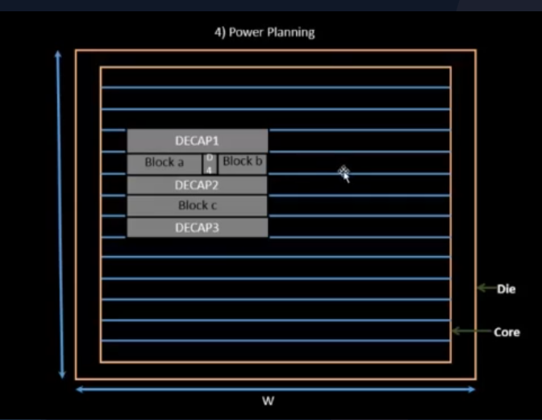
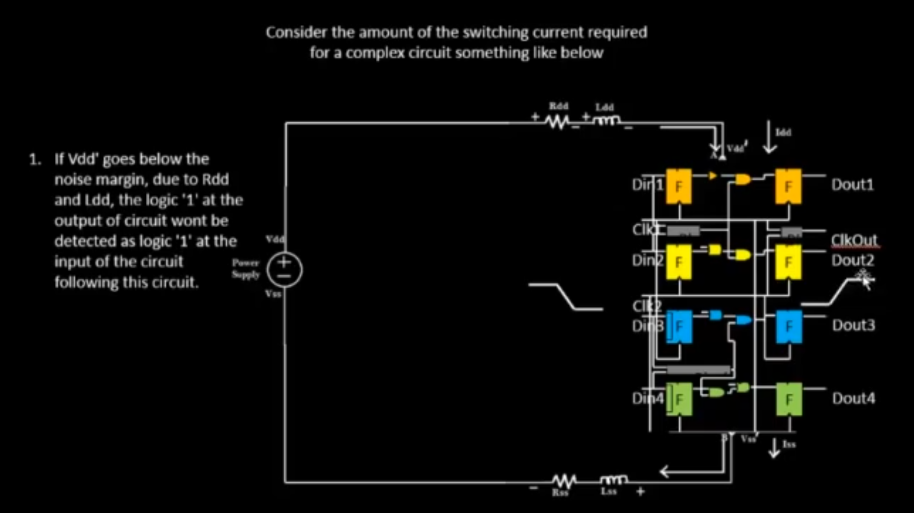
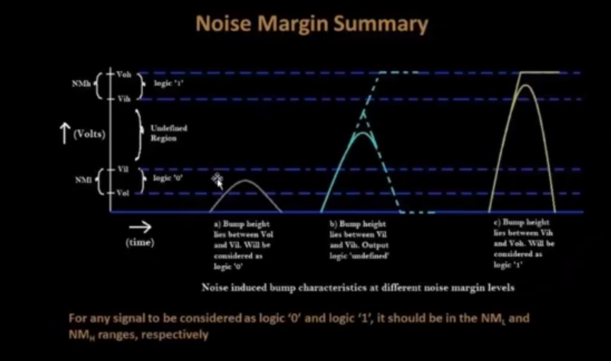

# SKY_L3 - Decoupling Capacitors

## Introduction

This lecture continues the discussion on Pre-Placed Cells and introduces:

- Decoupling Capacitors (Decaps)
- Voltage Drop Problems
- Noise Margins
- Local Power Integrity

The lecture explains why large pre-placed macros require local charge storage and how decoupling capacitors help maintain reliable logic operation.

---

# Review of Pre-Placed Cells

Pre-placed cells are typically:

- Memories
- Large IPs

These blocks are:

- implemented separately
- reused multiple times
- fixed in position before placement begins

Their locations remain unchanged throughout the physical design flow.

---

# Positioning of Pre-Placed Cells

The placement of macros depends on Design Requirements. For example:

- Input pins may be located on one side of the chip.
- Output pins may be located on the opposite side.

If certain macros communicate heavily with input signals, they may be placed closer to the input side.

Example:



The macro locations are chosen based on:

- communication requirements
- signal flow
- design architecture

Once placed:
```text
Location = Fixed
```
and cannot be modified by placement tools.
---

# Need for Decoupling Capacitors

After placing macros, the next step is to provide Decoupling Capacitors around them. The lecture explains this using the example of a switching logic gate.

---

# Switching Activity Inside a Logic Gate

Consider an AND gate. When its output transitions:
```text
Logic 0 → Logic 1
```
internal capacitances must charge. This requires Current from Vdd. Similarly, during:
```text
Logic 1 → Logic 0
```
the stored charge must discharge through Vss/Ground. Thus every switching event creates:

- current demand
- charge movement

inside the circuit.

---

# Ideal Power Supply Assumption

Ideally:
```text
Vdd = Constant
```
and every gate receives:
```text
Exact Supply Voltage
```
regardless of its location. In practice this assumption is not valid.

---

# Real Power Distribution Network

Physical power wires have:

- resistance (R)
- inductance (L)
- capacitance (C)

because they possess:

- finite length
- finite width
- physical dimensions

Thus power delivery paths are not ideal conductors.

---



---

# Voltage Drop Problem

As current travels through power wires:

voltage drops occur.

Consider:
```text
Vdd = 1.0 V
```
at the source. After traveling through resistive and inductive wires, the local supply may become
```text
Vdd' = 0.7 V
```
instead of the original 1 V.

---

# Consequence of Voltage Drop

A gate can only charge its output up to:
```text
Local Supply Voltage
```
Therefore:
```text
Maximum Output Voltage ≤ Vdd'
```
If:
```text
Vdd' = 0.7 V
```
then the gate output cannot exceed:
```text
0.7 V
```
even though the ideal supply is:
```text
1.0 V
```

---

# Noise Margin Concept

To correctly interpret logic values, the output voltage must fall inside valid noise-margin regions. The lecture discusses four important voltages:

---

## Vol

Maximum output voltage interpreted as logic 0.

---

## Vil

Maximum input voltage still recognized as logic 0.

---

## Vih

Minimum input voltage recognized as logic 1.

---

## Voh

Minimum output voltage guaranteed as logic 1.

---



---

# Undefined Region

The voltage range:
```text
Vil < Voltage < Vih
```
is called the Undefined Region. Inside this range:

- logic 0 is not guaranteed
- logic 1 is not guaranteed

The circuit may interpret the signal unpredictably. 

---

# Safe Logic-1 Operation

If the reduced supply voltage:
```text
Vdd'
```
still produces an output above:
```text
Vih
```
the circuit remains safe. Example:
```text
Output = 0.7 V
```
and
```text
0.7 V > Vih
```
then:
```text
Logic 1 is correctly detected
```

---

# Unsafe Operation

Suppose voltage drop becomes severe. Example:
```text
Vdd' = 0.5 V
```
If:
```text
0.5 V
```
falls inside the undefined region, the receiving gate may interpret the signal as logic 0 or logic 1, resulting in unreliable operation.

---

# Root Cause

The main reason is Large Physical Distance between power source and switching circuitry. The longer the path

- the larger the resistance
- the larger the voltage drop

---

# Solution - Decoupling Capacitors

To solve this problem Decoupling Capacitors (Decaps) are placed near the circuitry. A decoupling capacitor acts as:
```text
Local Charge Reservoir
```
stored very close to the switching logic. 

---

# Working Principle

Initially:
```text
Decap Voltage = Vdd
```
The capacitor stores charge while the circuit is idle. When switching occurs:
```text
Decap → Supplies Current
```
to nearby logic. Since the decap is physically close:

- wire resistance is minimal
- voltage drop is negligible

Thus the circuit receives nearly the full supply voltage.

---

# Decoupling Effect

The capacitor effectively decouples the switching circuitry from the distant power source. Instead of obtaining current directly from:
```text
Main Vdd
```
the gate temporarily obtains current from:
```text
Nearby Decap
```
This improves power integrity.

---

# Recharging the Decap

After switching, the decap loses some stored charge.
During idle periods:
```text
Main Supply → Recharges Decap
```
restoring it back to:
```text
Vdd
```
for future switching events.

---

# Decap Placement Around Macros

The lecture illustrates surrounding macros with decaps. Decoupling capacitors are placed around:

- memories
- large macros
- reusable IP blocks

to ensure stable local power delivery.


---

# Benefits of Decoupling Capacitors

Decaps help:

- reduce local voltage drop
- provide transient current
- improve logic reliability
- maintain noise margins
- reduce switching-related failures

---

# Local vs Global Communication

After inserting decaps, Local Communication Problems are largely addressed. Nearby circuits can obtain charge quickly from local storage.

---

# Key Takeaways

- Pre-placed cells are fixed macros placed before standard-cell placement.
- Macro locations are determined by communication and design requirements.
- Switching logic requires current to charge and discharge capacitances.
- Physical wires introduce resistance and inductance.
- Voltage drops occur as current travels through power networks.
- Large voltage drops can violate noise margins.
- Decoupling capacitors act as local charge reservoirs.
- Decaps provide transient current during switching.
- Decaps reduce the effect of power supply voltage drops.
- Local power integrity is improved by surrounding macros with decoupling capacitors.