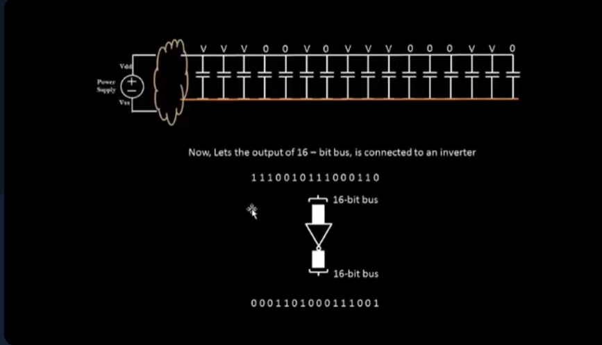
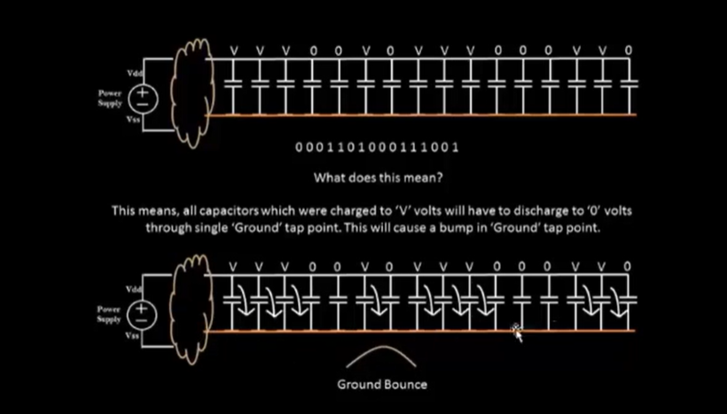
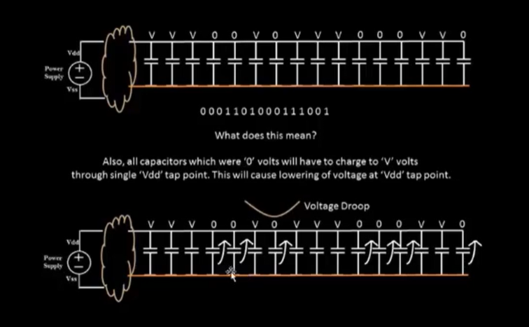
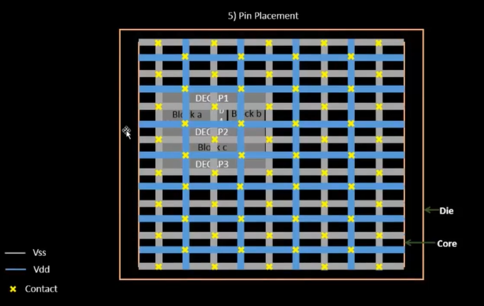

# SKY_L4 - Power Planning

## Introduction

This lecture discusses:

- Decoupling Capacitors
- Power Distribution

and introduces Power Planning. The lecture explains why decoupling capacitors alone cannot solve power delivery problems across an entire chip and motivates the need for a robust power distribution network (PDN).

---

# Limitation of Decoupling Capacitors

In the previous lecture:

- decoupling capacitors were placed around macros
- local switching current demands were handled successfully

However Modern chips contain multiple macros. Example:
```text
Macro A
Macro B
Macro C
Macro D
```
all distributed across the chip. Each macro may simultaneously demand current during switching activity.

---

# Example Chip Structure

Consider a chip containing:

- Four macros
- Additional surrounding logic

All of these blocks require:

- power delivery
- ground return paths

during operation.

---

# Driver-to-Load Communication

Assume a signal travels from:
```text
Driver → Load
```
The signal transitions:
```text
Logic 0 → Logic 1
```
The goal is to Preserve Signal Integrity. The waveform observed at the load should closely match the waveform launched by the driver.

---

# Power Requirement of Interconnects

Signal wires are not ideal. Long interconnects contain:

- parasitic capacitance
- parasitic resistance

When a wire switches:
```text
0 → 1
```
its capacitance must charge. When it switches:
```text
1 → 0
```
its capacitance must discharge. Thus interconnects themselves consume current from the power network. 

---

# Example - 16-bit Bus

Consider a 16-bit Bus. Each line of the bus has associated capacitance. For a logic value:
```text
1
```
the corresponding capacitance is charged to:
```text
Vdd
```
For a logic value:
```text
0
```
the capacitance is discharged to:
```text
Vss
```

---

# Simultaneous Switching Scenario

Suppose the entire bus drives An Inverter. The inverter output produces:
```text
Bitwise Complement
```
of the input. As a result:

- all previously charged capacitors discharge
- all previously discharged capacitors charge

at the same time. This creates Simultaneous Switching Current

---



---

# Ground Bounce

Consider the transition:
```text
1 → 0
```
All charged capacitors discharge simultaneously. Their charge flows into:
```text
Ground Network
```
Because many capacitors discharge at once, a temporary voltage spike appears on ground. This phenomenon is called Ground Bounce.

---

# Ground Bounce Illustration

Ideal Ground:
```text
0 V
```
Actual Ground:
```text
0 V
  ^
  |
 Small Voltage Spike
```
Ground temporarily rises above:
```text
0 V
```
instead of remaining perfectly constant. 

---

# Why Ground Bounce is Dangerous

If the ground spike becomes large enough, it may enter the Undefined Noise Margin Region. This may cause logic values to be interpreted incorrectly. Result:

- unpredictable behavior
- possible logic failures

---



---

# Voltage Droop

Now consider the opposite transition:
```text
0 → 1
```
All capacitors attempt to charge simultaneously. This creates Large Current Demand from the power supply. Because many nodes request current at once, the available supply voltage drops temporarily. This phenomenon is called Voltage Droop.

---

# Consequences of Voltage Droop

The actual supply becomes:
```text
Vdd_actual < Vdd_nominal
```
The reduced voltage may:

- shrink noise margins
- reduce switching speed
- create timing failures

If severe enough logic may enter the undefined region.

---



---

# Root Cause Analysis

Both:

- Ground Bounce
- Voltage Droop

originate from the same issue - Single-Point Power Delivery.mPower is supplied from only one location. All switching elements compete for the same source. 

---

# Better Approach

Instead of:
```text
One Power Source
```
provide:
```text
Multiple Power Sources
```
distributed throughout the chip. This reduces:

- current travel distance
- voltage drop
- ground bounce

---

# Distributed Power Network

Modern chips distribute:

- Vdd
- Vss

across the entire design. Any logic block can access:

- nearest Vdd
- nearest Vss

rather than relying on a distant supply source. 

---

# Power Mesh Concept

The distributed power network forms a Power Mesh. A power mesh consists of:

- horizontal Vdd lines
- vertical Vdd lines
- horizontal Vss lines
- vertical Vss lines

all interconnected.

---

# Structure of Power Mesh



This creates multiple current paths throughout the chip.

---

# Benefits of Power Mesh

A power mesh provides:

- lower IR drop
- reduced voltage droop
- reduced ground bounce
- better power integrity
- shorter current paths

Any logic element can obtain power from:
```text
Nearest Vdd Line
```
and return charge through:
```text
Nearest Vss Line
```

---

# Why Modern Chips Have Many Power Pins

Modern IC packages often contain:

- multiple Vdd pins
- multiple Vss pins

instead of only one power pin to Improve Power Distribution and reduce:

- supply noise
- IR drop
- current bottlenecks

---

# Role of Power Planning

Power planning is the process of designing Power Distribution Network (PDN) that ensures:

- reliable power delivery
- stable ground reference
- low voltage drop
- low supply noise

across the entire chip.

---

# Floorplanning Status

At this point the floorplanning process includes:

```text
Core Sizing
        ↓
Aspect Ratio Selection
        ↓
Pre-Placed Cell Placement
        ↓
Decoupling Capacitor Placement
        ↓
Power Planning
```

---

# Key Takeaways

- Decoupling capacitors solve local power delivery problems.
- Large chips contain many macros and switching elements.
- Simultaneous switching creates large current demand.
- Ground bounce occurs when many nodes discharge simultaneously.
- Voltage droop occurs when many nodes charge simultaneously.
- Both problems arise from single-point power delivery.
- Modern chips use distributed power networks.
- Power meshes provide multiple current paths.
- Multiple VDD and VSS pins improve power integrity.
- Power planning creates a robust chip-wide power distribution network.
