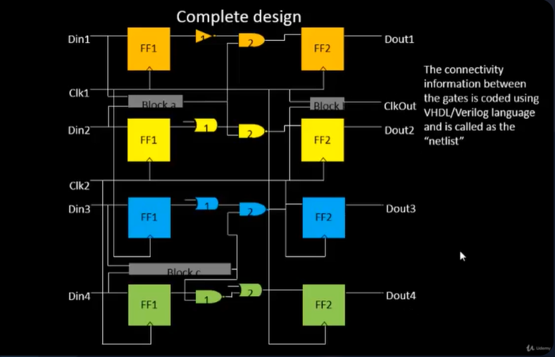
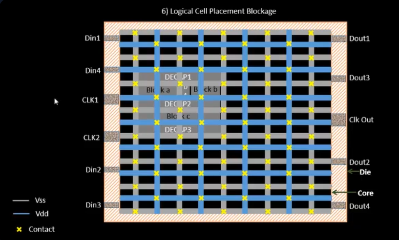

# SKY_L5 - Pin Placement and Logical Cell Placement Blockage

## Introduction

This lecture explains the final stage of floorplanning:

- Pin Placement
- Logical Cell Placement Blockage

The lecture demonstrates how input/output ports are assigned physical locations around the chip boundary and why certain regions must be reserved from automatic placement.

---

# Example Design

To explain pin placement, the lecture uses a sample design containing:



---

# What is a Netlist?

A Netlist defines:

- gate connectivity
- signal connectivity
- module interconnections

The netlist describes:
```text
Who connects to whom
```
and is typically represented using:

- Verilog
- VHDL

---

# Design Inputs and Outputs

The complete design contains:

## Input Ports

```text
Din1
Din2
Din3
Din4

Clk1
Clk2
```

---

## Output Ports

```text
Dout1
Dout2
Dout3
Dout4

ClkOut
```

---

# Core and Die Structure

The lecture considers a standard floorplan:

```text
+---------------------+
|        Die          |
|  +---------------+  |
|  |     Core      |  |
|  +---------------+  |
+---------------------+
```

The region between:
```text
Core
and
Die
```
is used for Pin Placement.

---

# Pin Placement Strategy

A common convention is that of placing Inputs on:
```text
Left Side
```
and that of placing Outputs on:
```text
Right Side
```
However, actual placement depends on:

- designer preference
- routing requirements
- floorplan constraints

---

# Inputs and Outputs Need Not Be Ordered

Input ordering may look random. Similarly outputs may appear in seemingly random order. This is intentional.

---

# Why Port Ordering Appears Random

Pins are placed based on Connectivity rather than numerical order. For example:
Block A receives:
```text
Din1
Din2
```
Therefore Block A should be located close to:
```text
Din1
Din2
```
to reduce:

- wirelength
- routing congestion

---

# Influence of Macro Placement

Since:

- Block A
- Block B
- Block C

already occupy fixed positions,

pin locations are chosen to minimize:

- routing distance
- congestion
- unnecessary crossings

Thus pin placement depends heavily on Floorplan Knowledge.

---

# Front-End and Back-End Interaction

Pin placement creates an important interface between Front-End Team, Responsible for:

- RTL design
- netlist generation
- functional implementation

and Back-End Team, Responsible for:

- floorplanning
- placement
- routing
- physical implementation

Pin placement acts as a Handshake Point between these teams.

---

# Clock Pins are Larger

```text
Clk1
Clk2
ClkOut
```
are drawn larger than data pins. This is intentional.

---

# Why Clock Pins are Larger

Clock signals drive:

- many flip-flops
- large clock trees
- high fanout networks

Therefore they require Lower Resistance Paths. Larger pins provide:

- lower resistance
- improved current handling
- better clock quality

---

# Clock Distribution Importance

Unlike data signals, clock signals switch continuously. Thus:
```text
Clock Integrity
```
is extremely important. Reducing resistance helps:

- lower delay
- reduce skew
- improve timing

---

# Logical Cell Placement Blockage

After pin placement, the region reserved for pins must be protected. This is achieved using Logical Cell Placement Blockage.

---

# Purpose of Placement Blockage

Placement blockage prevents:

- standard cells
- flip-flops
- combinational logic

from being placed inside reserved regions. Example:

---

# Why Blockages are Necessary

Without blockages, the automated placement tool may:

- place cells over pin regions
- create routing difficulties
- violate floorplan intent

Blockages guarantee:
```text
Reserved Space Remains Reserved
```
throughout implementation.

---



---

# Completion of Floorplanning

At this point the floorplan contains:

```text
Core Dimensions
        ↓
Aspect Ratio
        ↓
Pre-Placed Cells
        ↓
Decoupling Capacitors
        ↓
Power Planning
        ↓
Pin Placement
        ↓
Placement Blockages
```

The floorplan is now ready for Placement, which is the next stage of physical design.

---

# Key Takeaways

- Pin placement assigns physical locations to I/O ports.
- Pin positions depend on connectivity rather than naming order.
- Pre-placed macro locations heavily influence pin placement.
- Netlists describe connectivity between logic elements.
- Clock ports are typically larger than data ports.
- Larger clock pins reduce resistance and improve clock distribution.
- Logical cell placement blockages reserve specific chip regions.
- Placement blockages prevent automated tools from placing cells in restricted areas.
- Floorplanning is completed after pin placement and blockage definition.
- The next physical design stage is placement.